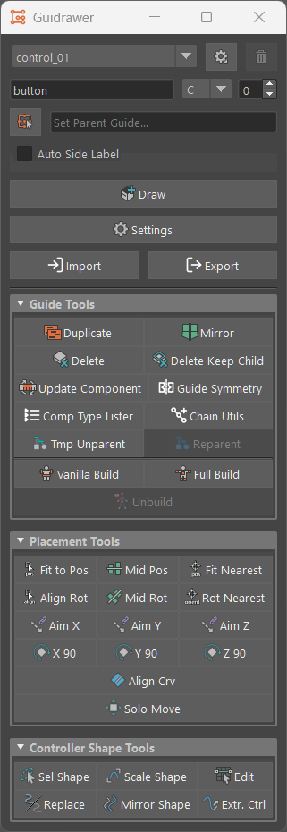

# Guidrawer

Guidrawer is a utility tool for the rigging framework [mGear](https://github.com/mgear-dev/mgear). It is designed to assist "custom" guide drawing during rigging operations on Maya.



## Installation

### A. Maya module

1. Copy this repository to your Maya modules directory as `guidrawer`.

   - Windows: `%USERPROFILE%\Documents\maya\modules\guidrawer`
   - macOS: `~/Library/Preferences/Autodesk/maya/modules/guidrawer`
   - Linux: `~/maya/modules/guidrawer`

2. Copy `guidrawer.mod` from the repository to the same `modules` directory (next to the `guidrawer` folder).

3. Restart Maya.

After restart, `import guidrawer` is available without changing `PYTHONPATH` or `sys.path`.
The MEL menu entries in `scripts/` are also loaded automatically.

### B. From a release

1. Open the [Releases](https://github.com/zebraed/guidrawer/releases) page and download the ZIP for the version you want
2. Extract the archive to a location of your choice
3. Install using **A. Maya module** above, or add the extracted `python` directory to `PYTHONPATH` in `Maya.env`:

## Usage

To use Guidrawer as GUI on Maya, follow these steps:

1. Import the module: `import guidrawer`
2. Call the show functions: `guidrawer.showUI()`


Any component type registered in mGear (classic / EPIC / custom via
`MGEAR_SHIFTER_COMPONENT_PATH`) can be drawn without writing extra code.

To customize the drawing process, add a preset module under
`guidrawer/component/`. A preset is a plain module (no class required)
that defines:

```python
NAME = "my_preset"            # display name in UI
COMPONENT_TYPE = "control_01" # mGear component type to draw
ORDER = 0                     # optional, sort order in UI

def draw_guide(name, side, idx, parent_root, **opt):
    ...
```

See `guidrawer/component/two_control_01.py` for a working example.

## License

[MIT License](LICENSE)
